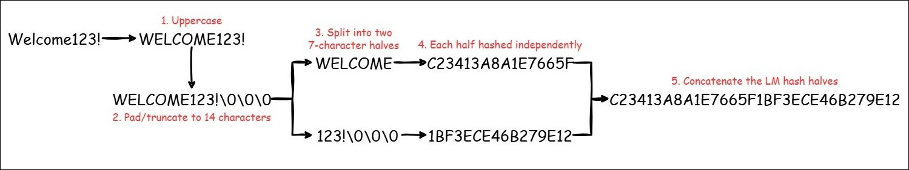

# LM Hashes

The `lm` module is used after LM password recovery to:

- Map recovered LM passwords back to user accounts (`map`)
- Generate password capitalisation candidates for recovered Domain Administrator passwords (`generate`)

```bash
-h
usage: main.py lm [-h] {map,generate} ...

LM password processing utilities used to reconstruct recovered LM passwords, 
map them to user accounts, and generate candidate password variants for 
privileged accounts.

positional arguments:
  {map,generate}
    map           Map recovered LM passwords to user accounts
    generate      Generate LM Domain Admin candidates

options:
  -h, --help      show this help message and exit

Examples:

    password-audit lm map \
        -N company.ntds \
        -P hashcat.potfile \
        -R lm-results.txt

    password-audit lm generate \
        -L ntds-organiser/mapped-lm-passwords.txt
```

## Map

```bash
$ password-audit lm map -h
usage: main.py lm map [-h] -N NTDS -P POTFILE -R LM_RESULTS [-O OUTPUT_DIR]

Reconstruct recovered LM passwords using Hashcat show results 
and map them back to user accounts within the NTDS dataset.

options:
  -h, --help            show this help message and exit

required arguments:
  -N, --ntds NTDS       SecretsDump NTDS file
  -P, --potfile POTFILE
                        Hashcat potfile containing recovered passwords
  -R, --lm-results LM_RESULTS
                        LM recovery results generated using hashcat --show

optional arguments:
  -O, --output-dir OUTPUT_DIR
                        Output directory (default: ntds-organiser)

Example:

    password-audit lm map \
        -N company.ntds \
        -P hashcat.potfile \
        -R lm-results.txt
```

If LM hashes are present within NTDS, `organise` identifies and extracts them:

```bash
 $ password-audit organise \
    -N example.ntds \
    -B bloodhound.zip

[*] Password Audit Organise

        NTDS Summary

| Object            | Value |
|-------------------|-------|
| Enabled Accounts  |   481 |
| Disabled Accounts |    42 |
| User Accounts     |   273 |
| Machine Accounts  |   208 |
| NTLM Hashes       |   164 |
| LM Hashes         |    88 |
| Domain Admins     |    23 |
| Company Words     |     3 |

[+] Output written to: ntds-organiser
```

These can be cracked as normal using the `crack run` command using Hashcat's LM mode (`3000`):

!!! info
    For an example JSON file see [Campaign Structure](crack.md#campaign-structure).

```bash
password-audit crack run \
    -C example-lm-config.json \
    -H ntds-organiser/lm-hashes.txt \
    -G example-lm-test
```

After cracking is complete, the recovered passwords must be mapped back to their users. This requires an [extra step](#why-the-extra-step) that is not yet integrated within `password-audit`:

!!! note
    Mapped LM passwords may outnumber recovered LM hashes due to password reuse and LM hash structure.

```bash
# Write the LM dataset to a file
$ hashcat -m3000 \
    --show ntds-organiser/lm-hashes.txt \
    --potfile-path hashcat.potfile \
    > lm-results.txt

# Map recovered passwords back to their users
$ password-audit lm map \
    -N example.ntds \
    -P hashcat.potfile \
    -R ntds-organiser/lm-results.txt

      LM Password Mapping

| Object              | Value |
|---------------------|-------|
| Mapped LM Passwords |    15 |

[+] Output Directory: ntds-organiser
```

The generated dataset will contain the recovered passwords in uppercase form:

```bash
$ grep 'WELCOME123!' ntds-organiser/mapped-lm-passwords.txt
domain.local\mike:WELCOME123!
```

The LM dataset can now be analysed and integrated within the final report and/or used to generate password candidates if a Domain Admin exists within it.

## Reporting

The LM dataset can be analysed to add LM-related findings to the final report (alongside the NTLM dataset):

```bash
$ password-audit analyse \
    -M ntds-organiser/mapped-ntlm-passwords.txt \
    -L ntds-organiser/mapped-lm-passwords.txt

[+] Report written to: report.md
[+] Findings written to: findings.json
```

The following LM findings are currently present:

* LM hash exposure
* Unique and duplicate LM hash analysis
* LM password recovery statistics
* LM Domain Administrator exposure

## Generate

The LM dataset can be processed further using the `generate` module.

```bash
$ password-audit lm generate -h
usage: main.py lm generate [-h] -L MAPPED_LM_PASSWORDS [-D DOMAIN_ADMINS] [-O OUTPUT_DIR]

Identify recovered LM passwords belonging to Domain Administrators 
and generate all possible password capitalisation variants.

options:
  -h, --help            show this help message and exit

required arguments:
  -L, --mapped-lm-passwords MAPPED_LM_PASSWORDS
                        Recovered LM passwords

optional arguments:
  -D, --domain-admins DOMAIN_ADMINS
                        Domain Admin account list (default: ./ntds-organiser/domain-admins.txt)
  -O, --output-dir OUTPUT_DIR
                        Output directory (default: ntds-organiser)

Example:

    password-audit lm generate \
        -L ntds-organiser/mapped-lm-passwords.txt
```

Because LM hashes do not preserve character casing, recovered passwords are presented in uppercase form and may not reflect the user's original password. The `generate` module identifies recovered LM passwords belonging to Domain Administrator accounts and generates all possible capitalisation variants, enabling recovery of the original password casing through password spraying:

!!! example
    The recovered password `WELCOME123!` contains seven alphabetic characters, each of which can be either uppercase or lowercase. As a result,
    `2^7 = 128` possible capitalisation variants are generated, one of which represents the user's original password.

```bash
$ password-audit lm generate \
    -L ntds-organiser/mapped-lm-passwords.txt

  LM Candidate Generation

| Object           | Value |
|------------------|-------|
| LM DA Users      |     0 |
| LM DA Candidates |     0 |


[+] Output Directory: ntds-organiser

# Recovered LM passwords belonging to Domain Administrators
$ head lm-da-passwords.txt
domain.local\mike:WELCOME123!

# Generated capitalisation variants
$ head -n5 lm-da-candidates.txt
WELCOME123!
WELCOMe123!
WELCOmE123!
WELCoME123!
WELcOME123!
```

The `lm generate` command generates three files:

- `lm-da-users.txt` containing Domain Administrator usernames
- `lm-da-passwords.txt` containing recovered LM passwords belonging to Domain Administrators
- `lm-da-candidates.txt` containing all generated capitalisation variants

The generated user and candidate datasets can then be used for password spraying (e.g. [`conpass`](https://github.com/login-securite/conpass)) to determine the original password capitalisation:

```bash
conpass -d <domain> \
    -u <user> \
    -p <pass> \
    -U lm-da-users.txt \
    -P lm-da-candidates.txt \
    --dc-ip <dc-ip>
```

## Why the Extra Step?

Unlike NTLM hashes, [LM passwords are processed in two independent 7-character halves](https://learn.microsoft.com/en-us/archive/blogs/miriamxyra/stop-using-lan-manager-and-ntlmv1#but-there-is-also-another-vulnerability-caused-by-the-first-implementation-of-this-protocol). Each half produces a separate LM hash value, resulting in a 32-character LM hash composed of two 16-character hash halves:



Hashcat [stores recovered LM hash (16-character) halves](https://hashcat.net/wiki/doku.php?id=example_hashes#:~:text=3000) in the potfile rather than the full 32-character values. Consequently, the potfile cannot be used directly to map recovered LM passwords back to user accounts:

```bash
# Full 32-character hash within the LM dataset
$ head -1 ntds-organiser/lm-hashes.txt
c23413a8a1e7665f1bf3ece46b279e12

# Stored halves within the potfile
$ grep 'c23413a8a1e7665f' hashcat.potfile
c23413a8a1e7665f:WELCOME
$ grep '1bf3ece46b279e12' hashcat.potfile
1bf3ece46b279e12:123!
```

As a result, an additional `hashcat --show` step is required to reconstruct the full LM hash and map recovered passwords back to user accounts:

!!! warning
    Perform this step from Bash. PowerShell may modify the potfile encoding and affect LM password reconstruction.

```bash
# Validate that the full LM hash is shown
$ hashcat -m3000 \
    --show ntds-organiser/lm-hashes.txt \
    --potfile-path hashcat.potfile \
    | grep 'WELCOME'
c23413a8a1e7665f1bf3ece46b279e12:WELCOME123!
```